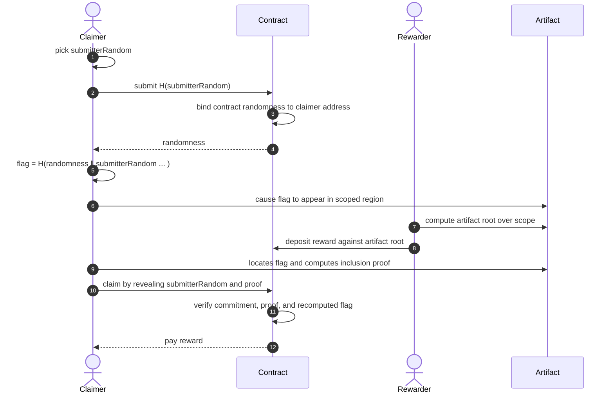

# Protocol

## 1. System Model

The protocol assumes a public, **deterministic execution environment** (smart contract platform) that provides persistent state, verifiable computation, and automatic fund custody. We refer to operations performed in this environment as on-chain; all other operations are off-chain or off-protocol.

### 1.1 Artifacts and Inclusion Proofs

An *artifact* is a published software package, container image, binary, or other distributable unit. The protocol identifies artifacts by an ***artifact root***: a cryptographic hash computed over the artifact's content — for instance, the root of a Merkle tree over fixed-size chunks. An ***inclusion proof*** allows the protocol to verify that a given data chunk belongs to the artifact identified by a specific root, without access to the full artifact. Using a Merkle tree, such proofs are logarithmic in the number of chunks and efficient to verify on-chain.

### 1.2 Scope

Scope constraints determine which regions of an artifact are eligible for claims. A rewarder defines a scope by selecting the security-relevant byte ranges of the artifact and computing the artifact root over only those ranges. Regions outside the scope are absent from the tree, making out-of-scope embeddings impossible to prove. Any party with access to the artifact data and the scope definition can independently verify that the on-chain artifact root was computed correctly.

### 1.3 Target

A target identifies a specific artifact version and scope for which the protocol can verify claims against. On-chain, a target is represented by its artifact root. Different scope definitions over the same artifact produce different targets.

Off-chain, human-readable **project identifiers** (e.g., a package registry URL) may map to one or more targets across releases and scope definitions; these identifiers have no on-chain semantics.
A shared identifier serves as a coordination point: parties interested in a project's integrity are incentivized to concentrate funds under a single identifier as an economic signal.

### 1.4 Actors

The protocol involves three roles.

**Claimers** discover and demonstrate supply chain weaknesses by embedding flags into target artifacts.

**Rewarders** fund bounties by depositing funds against specific targets they wish to protect. Multiple rewarders may fund the same target, crowdsourcing the bounty.

**Maintainers** control the production and publication of artifacts and may publish scope definitions for their artifacts, enabling rewarders to construct accurate scoped roots for every new artifact release. Maintainers may participate as claimers through control claims.

### 1.5 Rewards

A reward is a deposit of funds bound to a target. Rewards signal which artifacts and projects are valued.

## 2. Protocol

This section presents a minimal instantiation of the TAINT protocol; specific components — the integrity proof scheme, the flag extraction strategies, the economic model — can be replaced or extended in future work.

### 2.1 Overview

The protocol has four phases: commitment (claimer commits a secret), embedding (claimer propagates the derived flag into a target artifact), funding (rewarders stake funds on a specific artifact), and claim (claimer proves flag inclusion).



### 2.2 Commit and Flag Derivation

The claimer selects a random secret `submitterRandom` and submits `commitmentHash` to the contract, where `commitmentHash = H(submitterRandom)` and `H` is a cryptographic secure collision-resistant hash function producing at least a 256-bit digest (e.g., Keccak-256). The contract records the commitment along with the committer's blockchain `address` or public key, binding the commitment to its creator.

The contract derives and stores an unpredictable value:

```
randomness = H(entropySource)
```

where `entropySource` is data not known to the claimer at submission time. After confirmation, the claimer reads `randomness` from the contract state.

Commitments are identified by their `commitmentHash` and are not bound to a specific project.

This design accommodates shared dependency attacks. When a single library is consumed by many downstream projects, a claimer who can embed one flag in that dependency can claim rewards against every affected target without requiring a separate flag and embedding for each one.

A claimer may hold multiple concurrent commitments, each derived from a distinct `submitterRandom`.

After commitment confirmation, the claimer computes:

```
flag = H(randomness ‖ submitterRandom ‖ address)
```

This flag cannot be precomputed; retroactive claims against pre-existing artifacts are impossible: `randomness` is fixed at commitment inclusion time, and `submitterRandom` is known only to the claimer.

### 2.3 Embedding

The claimer must embed the flag to appear in a chunk of the target artifact. TAINT is agnostic to the method of compromise and must support flexible ways of encoding claimer-controlled data into artifacts while remaining verifiable.

### 2.4 Funding

A rewarder posts a reward for a target depositing funds into the contract. Multiple rewarders may deposit funds against the same target, crowdsourcing the bounty.

### 2.5 Claim

The claimer submits a claim containing:

1. The random secret value (`submitterRandom`) that is now revealed.
2. The target identifier.
3. The data of the chunk containing the flag.
4. An inclusion proof for that chunk in the structure identified by the target's artifact root.
5. The deterministic function and its parameters to extract the flag from an artifact chunk data.

The contract verifies:

1. `H(submitterRandom)` matches a stored `commitmentHash` belonging to the claimer's address.
2. A reward exists for the given target.
3. The inclusion proof as defined in §1.1 confirms the submitted chunk belongs to the integrity structure identified by the target's artifact root.
4. The flag, recomputed as `H(randomness ‖ submitterRandom ‖ address)` using the stored `randomness` for this commitment, matches the value produced by applying the declared extraction function to the submitted chunk data.

On success, the contract initiates the reward distribution.

### 2.6 Reward Mechanics

A commitment is not consumed by a successful claim. The same commitment may be used to claim against multiple targets, provided a reward has been posted for each. The first successful claim opens a claim window of fixed duration; all subsequent claims must be submitted before the window closes. A commitment transitions through three states: *active* (no claims), *claiming* (window open), and *finalized* (window expired).

The minimal instantiation awards the full reward for a given target to the first valid claim. This is a deliberate simplification; concurrent independent work on the same target rewards only the fastest claimer. The reward distribution mechanism is designed as a replaceable component; [economics](economics.md) describes extensions.